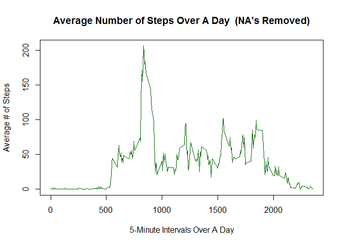

# Coursera - Reproducible Research: Course Project 1
Wing Kwong  
February 26, 2017  

## Introduction

This assignment makes use of data from a personal activity monitoring device.  This device collects data at 5-minute intervals throughout the day.  The data consists of 2 months of data from an anonymous person collected during the months of October and November, 2012; and include the number of steps taken in 5-minute intervals each day.

The variables included in this dataset are:

* steps: Number of steps taking in a 5-minute interval (missing values are coded as NA)
* date: The date on which the measurement was taken in YYYY-MM-DD format
* interval: Identifier for the 5-minute interval in which measurement was taken

The dataset is stored in a comma-separated-value (CSV) file; and there should be a total of 17,568 observations in this dataset.


## Loading and Preprocessing the Data

The data for this assignment can be downloaded from the course web site:

* Dataset: [Activity monitoring data](https://d396qusza40orc.cloudfront.net/repdata%2Fdata%2Factivity.zip) [52K]  
  
#### 1. Get and Load Data

```r
# Clear workspace
rm(list=ls())

# Specify data file download location
dataset_URL <- "https://d396qusza40orc.cloudfront.net/repdata/data/activity.zip"

# Download zipped data file to current directory
download.file(dataset_URL, destfile=basename(dataset_URL))

# Un-Zip data file and save in current directory
unzip(zipfile=basename(dataset_URL), exdir=".")

# Get the un-zipped original filename
file_name <- unzip(zipfile=basename(dataset_URL), list=TRUE)$Name

# Load raw data file into a data frame
df <- read.csv(file_name, stringsAsFactors=FALSE)
```
    
#### 2. Inspect Data

```r
# Examine structure of data frame
str(df)
```

```
## 'data.frame':	17568 obs. of  3 variables:
##  $ steps   : int  NA NA NA NA NA NA NA NA NA NA ...
##  $ date    : chr  "2012-10-01" "2012-10-01" "2012-10-01" "2012-10-01" ...
##  $ interval: int  0 5 10 15 20 25 30 35 40 45 ...
```

```r
# Summary of data frame
summary(df)
```

```
##      steps            date              interval     
##  Min.   :  0.00   Length:17568       Min.   :   0.0  
##  1st Qu.:  0.00   Class :character   1st Qu.: 588.8  
##  Median :  0.00   Mode  :character   Median :1177.5  
##  Mean   : 37.38                      Mean   :1177.5  
##  3rd Qu.: 12.00                      3rd Qu.:1766.2  
##  Max.   :806.00                      Max.   :2355.0  
##  NA's   :2304
```
* We can confirm the three variable names of the loaded dataset, and that it contains 17,568 rows of observations, with 2304 NA's.  And we note the 'date' values are currently stored in character format.
      

## What is mean total number of steps taken per day?

We may ignore the missing values in the dataset for this part of the assignment.  

#### 1. Calculate the total number of steps taken per day.

```r
# Load 'dplyr' package
suppressMessages(library(dplyr))

# Filter out NA's; group by date; and then calculate daily total steps
daily_steps_df <- df %>% filter(!is.na(steps)) %>% group_by(date) %>% summarise(daily_step_count = sum(steps))

# Check first several rows of summarized data frame to ensure daily total steps are calculated
head(daily_steps_df)
```

```
## # A tibble: 6 × 2
##         date daily_step_count
##        <chr>            <int>
## 1 2012-10-02              126
## 2 2012-10-03            11352
## 3 2012-10-04            12116
## 4 2012-10-05            13294
## 5 2012-10-06            15420
## 6 2012-10-07            11015
```

#### 2. Make a histogram of the total number of steps taken each day

```r
hist_plot <- hist(daily_steps_df$daily_step_count, 
             main = "Histogram of Total Steps per Day  (NA's Removed)", 
             xlab = "Daily Total Steps", 
             ylab = "# of Days", 
             col = "green", 
             breaks = seq(0, 25000, 1000))
```

<!-- -->

#### 3. Calculate and report the mean and median of the total number of steps taken per day

```r
# View summary statistics of data frame with activity info grouped and summarized by day
summary(daily_steps_df)
```

```
##      date           daily_step_count
##  Length:53          Min.   :   41   
##  Class :character   1st Qu.: 8841   
##  Mode  :character   Median :10765   
##                     Mean   :10766   
##                     3rd Qu.:13294   
##                     Max.   :21194
```
* Mean total steps taken per day = 10766 
* Median total steps taken per day = 10765 


## What is the average daily activity pattern?


```r
# Filter out NA's; group by the 5-min intervals; and then calculate mean steps for each interval
interval_steps_df <- df %>% filter(!is.na(steps)) %>% group_by(interval) %>% summarise(avg_steps_by_interval = mean(steps))

# Check last several rows of summarized data frame to ensure time series interval range up to the expected 2355 mark
tail(interval_steps_df)
```

```
## # A tibble: 6 × 2
##   interval avg_steps_by_interval
##      <int>                 <dbl>
## 1     2330             2.6037736
## 2     2335             4.6981132
## 3     2340             3.3018868
## 4     2345             0.6415094
## 5     2350             0.2264151
## 6     2355             1.0754717
```

```r
# Check summarized data frame contains the expected 288 rows of time series data points
nrow(interval_steps_df)
```

```
## [1] 288
```

#### 1. Make a time series plot (i.e. type = "l") of the 5-minute interval (x-axis) and the average number of steps taken, averaged across all days (y-axis)

```r
plot(x    = interval_steps_df$interval, 
     y    = interval_steps_df$avg_steps_by_interval, 
     main = "Average Number of Steps Over A Day  (NA's Removed)", 
     xlab = "5-Minute Intervals Over A Day", 
     ylab = "Average # of Steps", 
     type = "l", 
     col  = "darkgreen", 
     lwd  = 1 )
```

<!-- -->

#### 2. Which 5-minute interval, on average across all the days in the dataset, contains the maximum number of steps?

```r
# Identify the summarized data frame row(s) containing the maximum # of steps
subset(interval_steps_df, avg_steps_by_interval == max(avg_steps_by_interval))
```

```
## # A tibble: 1 × 2
##   interval avg_steps_by_interval
##      <int>                 <dbl>
## 1      835              206.1698
```
* The 5-minute interval with the highest average number of steps (206.1698) is interval 835.


## Imputing missing values

There are a number of days/intervals with missing values (coded as NA).  The presence of missing days may introduce bias into some calculations or summaries of the data.

#### 1. Calculate and report the total number of missing values in the dataset (i.e. the total number of rows with NA's).
The total number of rows in the dataset with missing values was determined to be 2304 early on in this analysis by inspecting the summary statistics of the input data frame. 

Here we double check this count (2304 NA's) using different R code shown below.

```r
# Another way to determine # of rows with NA's
sum(is.na(df$steps))
```

```
## [1] 2304
```

#### 2. Devise a strategy for filling in all of the missing values in the dataset.  
* My strategy for filling in the missing steps values in the dataset shall be to substitute the mean value for that 5-minute interval.

#### 3. Create a new dataset that is equal to the original dataset but with the missing data filled in.

```r
# Make a copy of the data frame
new_df <- df

# Add new column to new data frame wherein NA step values are substituted with the mean value for the corresponding 5-minute interval, otherwise the existing step value is kept
new_df <- mutate(new_df, imputed_steps = ifelse(is.na(new_df$steps), interval_steps_df$avg_steps_by_interval[match(new_df$interval, interval_steps_df$interval)], new_df$steps))

# Inspect new data frame, check if all NA's are substituted with imputed values in new column
str(new_df)
```

```
## 'data.frame':	17568 obs. of  4 variables:
##  $ steps        : int  NA NA NA NA NA NA NA NA NA NA ...
##  $ date         : chr  "2012-10-01" "2012-10-01" "2012-10-01" "2012-10-01" ...
##  $ interval     : int  0 5 10 15 20 25 30 35 40 45 ...
##  $ imputed_steps: num  1.717 0.3396 0.1321 0.1509 0.0755 ...
```

```r
head(new_df)
```

```
##   steps       date interval imputed_steps
## 1    NA 2012-10-01        0     1.7169811
## 2    NA 2012-10-01        5     0.3396226
## 3    NA 2012-10-01       10     0.1320755
## 4    NA 2012-10-01       15     0.1509434
## 5    NA 2012-10-01       20     0.0754717
## 6    NA 2012-10-01       25     2.0943396
```

```r
summary(new_df)
```

```
##      steps            date              interval      imputed_steps   
##  Min.   :  0.00   Length:17568       Min.   :   0.0   Min.   :  0.00  
##  1st Qu.:  0.00   Class :character   1st Qu.: 588.8   1st Qu.:  0.00  
##  Median :  0.00   Mode  :character   Median :1177.5   Median :  0.00  
##  Mean   : 37.38                      Mean   :1177.5   Mean   : 37.38  
##  3rd Qu.: 12.00                      3rd Qu.:1766.2   3rd Qu.: 27.00  
##  Max.   :806.00                      Max.   :2355.0   Max.   :806.00  
##  NA's   :2304
```

#### 4. Make a new histogram of the total number of steps taken each day, and calculate and report the mean and median total number of steps taken per day. 

```r
# Group by date; and then calculate new daily total steps
new_daily_steps_df <- new_df %>% group_by(date) %>% summarise(new_daily_step_count = sum(imputed_steps))

# View summary statistics for the mean and median total number of steps taken per day
summary(new_daily_steps_df)
```

```
##      date           new_daily_step_count
##  Length:61          Min.   :   41       
##  Class :character   1st Qu.: 9819       
##  Mode  :character   Median :10766       
##                     Mean   :10766       
##                     3rd Qu.:12811       
##                     Max.   :21194
```
* New Mean total steps taken per day = 10766 
* New Median total steps taken per day = 10766


Do these values differ from the estimates from the first part of the assignment?   

* No, the mean and median values are preserved using this strategy for filling in missing steps values in the dataset.

Here is the new histogram:

```r
hist(new_daily_steps_df$new_daily_step_count, 
     main = "Histogram of Total Steps per Day  (with Imputed Data for NA's)", 
     xlab = "Daily Total Steps", 
     ylab = "# of Days", 
     ylim = c(0, 20), 
     col = "blue", 
     breaks = seq(0, 25000, 1000))
```

<!-- -->

Here is a visual comparison of the new and previous histograms along same X & Y axis scales.

```r
# Display two plots side-by-side
par(mfrow=c(1,2))

hist(daily_steps_df$daily_step_count, 
     main     = "Total Steps per Day\n( NA's Removed )", 
     xlab     = "Daily Total Steps", 
     ylab     = "# of Days", 
     ylim     = c(0, 20), 
     cex.main = 1, 
     cex.axis = 0.667, 
     col      = "green", 
     breaks   = seq(0, 25000, 1000))

hist(new_daily_steps_df$new_daily_step_count, 
     main     = "Total Steps per Day\n( Imputed Data for NA's )", 
     xlab     = "Daily Total Steps", 
     ylab     = "# of Days", 
     ylim     = c(0, 20), 
     cex.main = 1, 
     cex.axis = 0.667, 
     col      = "blue", 
     breaks   = seq(0, 25000, 1000))
```

<!-- -->

What is the impact of imputing missing data on the estimates of the total daily number of steps?

* There would be no impact to the Mean or Median measures of centrality for summary staistics (such as the total daily number of steps) by imputing missing data in this fashion.

* However, there would be more recognized data points put back into the analysis dataset, as can be seen in the side-by-side histograms showing the occurance frequency of the total daily # of steps at the central value (10766) has increased.  Using a bin size of 1000 steps, the frequency count of the central bin (10,000 - 11,000) increased from 10 to 18 days, corresponding exactly to the 2304 missing values that represented the 8 days of missing data. 


## Are there differences in activity patterns between weekdays and weekends?

#### 1. Create a new factor variable in the dataset with two levels - "weekday" and "weekend" indicating whether a given date is a weekday or weekend day.

```r
weekends <- c("Saturday", "Sunday")

new_df$weekday_or_weekend <- as.factor( ifelse(is.element(weekdays(as.Date(new_df$date)), weekends), "Weekend", "Weekday") )

str(new_df)
```

```
## 'data.frame':	17568 obs. of  5 variables:
##  $ steps             : int  NA NA NA NA NA NA NA NA NA NA ...
##  $ date              : chr  "2012-10-01" "2012-10-01" "2012-10-01" "2012-10-01" ...
##  $ interval          : int  0 5 10 15 20 25 30 35 40 45 ...
##  $ imputed_steps     : num  1.717 0.3396 0.1321 0.1509 0.0755 ...
##  $ weekday_or_weekend: Factor w/ 2 levels "Weekday","Weekend": 1 1 1 1 1 1 1 1 1 1 ...
```

#### 2. Make a panel plot containing a time series plot (i.e. type = "l") of the 5-minute interval (x-axis) and the average number of steps taken, averaged across all weekday days or weekend days (y-axis).

```r
# Group by weekday or weekend factor, then group by 5-min intervals; 
# and then calculate mean steps of each 5-min interval for weekday and weekend data groupings
new_interval_steps_df <- new_df %>% group_by(weekday_or_weekend, interval) %>% summarise(avg_steps_by_interval = mean(imputed_steps))

# Check new summarized data frame contains the expected 576 rows (288 x 2) of time series data points for making panel plot
str(new_interval_steps_df)
```

```
## Classes 'grouped_df', 'tbl_df', 'tbl' and 'data.frame':	576 obs. of  3 variables:
##  $ weekday_or_weekend   : Factor w/ 2 levels "Weekday","Weekend": 1 1 1 1 1 1 1 1 1 1 ...
##  $ interval             : int  0 5 10 15 20 25 30 35 40 45 ...
##  $ avg_steps_by_interval: num  2.251 0.445 0.173 0.198 0.099 ...
##  - attr(*, "vars")=List of 1
##   ..$ : symbol weekday_or_weekend
##  - attr(*, "drop")= logi TRUE
```

```r
# Make panel plot with Lattice Graphics package
library(lattice)

xyplot(avg_steps_by_interval ~ interval | weekday_or_weekend, new_interval_steps_df, 
       main   = "Average # of Steps Over A Day", 
       xlab   = "5-Min Intervals Over A Day", 
       ylab   = "Average # of Steps", 
       layout = c(1,2), 
       col    = "blue", 
       lwd    = 1, 
       type   = "l" )
```

<!-- -->

* The panel plot shows this person is up and more active earlier during weekday mornings.  However on weekend afternoons and evenings, this person is overall more active than weekday afternoons and evenings.


## Working Environment
For reproducibility, here is the R session information associated with the output.

```r
# Print version information about R, operating system, and attached or loaded packages
sessionInfo()
```

```
## R version 3.3.2 (2016-10-31)
## Platform: x86_64-w64-mingw32/x64 (64-bit)
## Running under: Windows 7 x64 (build 7601) Service Pack 1
## 
## locale:
## [1] LC_COLLATE=English_Canada.1252  LC_CTYPE=English_Canada.1252   
## [3] LC_MONETARY=English_Canada.1252 LC_NUMERIC=C                   
## [5] LC_TIME=English_Canada.1252    
## 
## attached base packages:
## [1] stats     graphics  grDevices utils     datasets  methods   base     
## 
## other attached packages:
## [1] lattice_0.20-34 dplyr_0.5.0    
## 
## loaded via a namespace (and not attached):
##  [1] Rcpp_0.12.9     digest_0.6.12   rprojroot_1.2   assertthat_0.1 
##  [5] grid_3.3.2      R6_2.2.0        DBI_0.5-1       backports_1.0.5
##  [9] magrittr_1.5    evaluate_0.10   stringi_1.1.2   lazyeval_0.2.0 
## [13] rmarkdown_1.3   tools_3.3.2     stringr_1.2.0   yaml_2.1.14    
## [17] htmltools_0.3.5 knitr_1.15.1    tibble_1.2
```

```r
# Current Date & Time
format(Sys.time(), tz="GMT", usetz=TRUE)
```

```
## [1] "2017-02-27 00:45:08 GMT"
```
